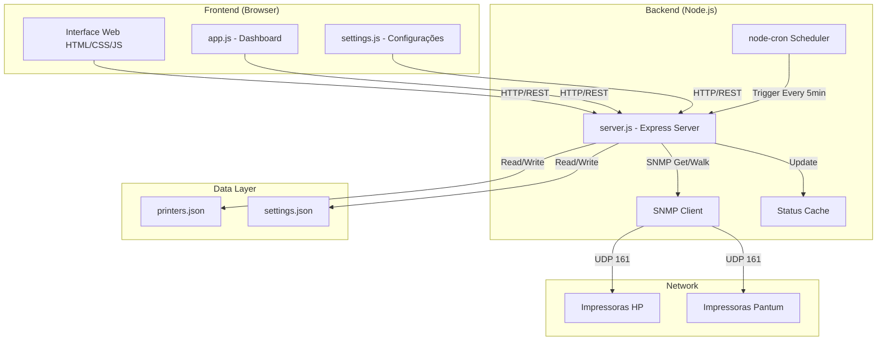
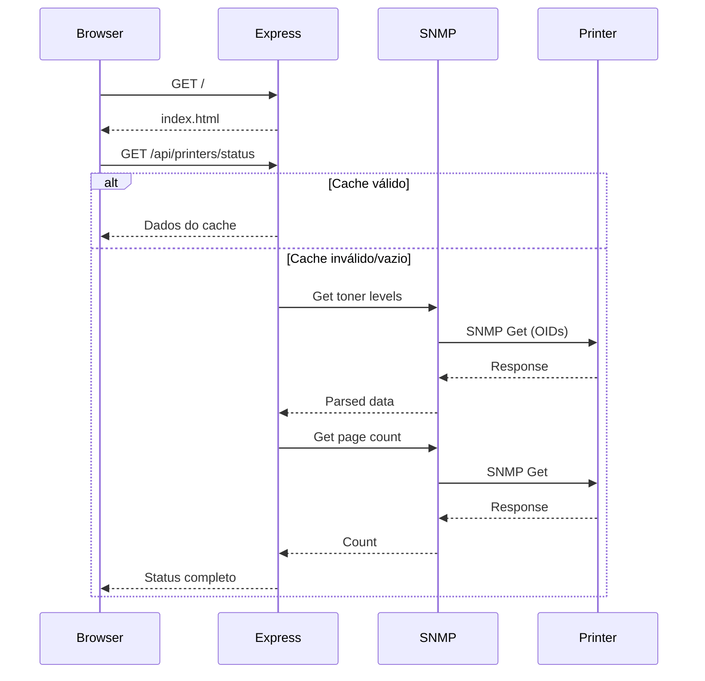
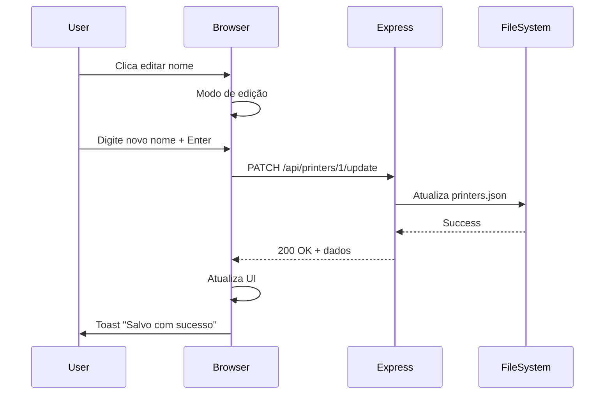
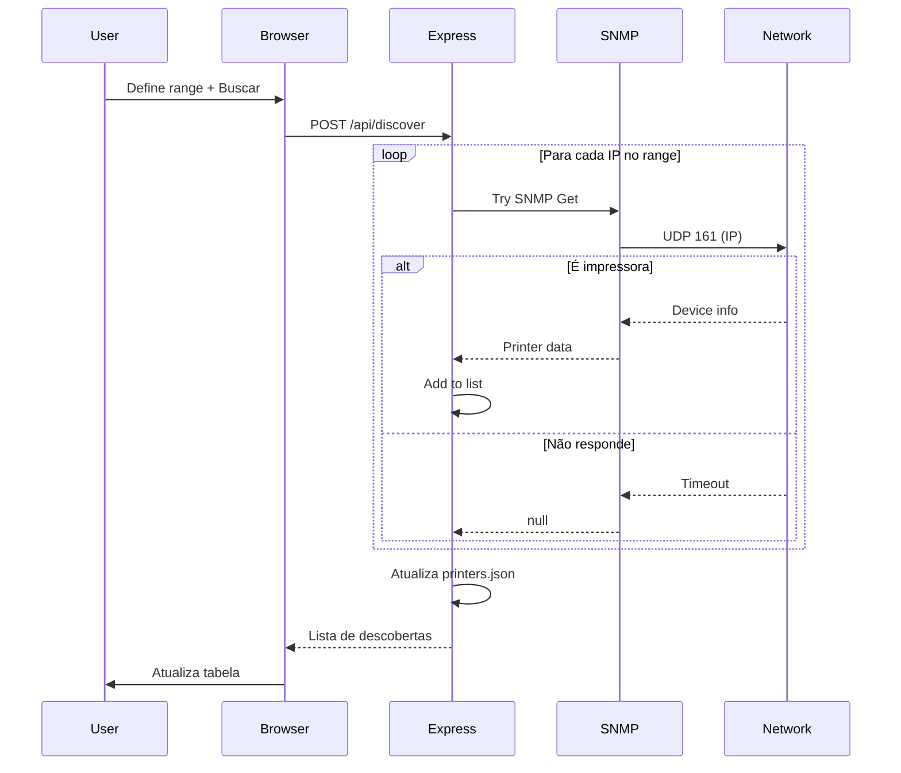

# Documentação Técnica

Documentação técnica abrangente do sistema **Monitor de Toner**.

## 📋 Índice

- [Visão Geral](#visão-geral)
- [Arquitetura do Sistema](#arquitetura-do-sistema)
- [Componentes](#componentes)
- [Tecnologias](#tecnologias)
- [Fluxo de Dados](#fluxo-de-dados)
- [Estrutura de Arquivos](#estrutura-de-arquivos)
- [Esquema de Dados](#esquema-de-dados)
- [Guia de Desenvolvimento](#guia-de-desenvolvimento)

---

## Visão Geral

O Monitor de Toner é um sistema web de monitoramento em tempo real para impressoras de rede, utilizando o protocolo SNMP para coletar informações sobre níveis de toner, contadores de páginas e status de conexão.

### Principais Características

- **Arquitetura**: Cliente-Servidor (SPA + REST API)
- **Protocolo**: SNMP v1/v2c sobre UDP
- **Fabricantes Suportados**: HP, Pantum
- **Atualização**: Automática (5 minutos) e Manual
- **Persistência**: Arquivo JSON local
- **Interface**: Responsiva, Dark Mode, Glassmorphism

---

## Arquitetura do Sistema



### Camadas

1. **Frontend (Client-Side)**
   - Interface do usuário em HTML/CSS/JavaScript puro
   - Dashboard principal com cards responsivos
   - Página de configurações com auto-discovery
   - Manual do usuário integrado

2. **Backend (Server-Side)**
   - Servidor Express.js na porta 3000
   - Cliente SNMP para comunicação com impressoras
   - Sistema de cache em memória
   - Agendador de tarefas automáticas

3. **Data Layer**
   - Arquivos JSON para persistência
   - Sem banco de dados externo
   - Configurações editáveis via API

---

## Componentes

### Backend (`server.js`)

#### Principais Funções

| Função | Descrição | Retorno |
|--------|-----------|---------|
| `getPrinterTonerLevels(ip, manufacturer)` | Obtém níveis de toner via SNMP | Object |
| `getPrinterPageCount(ip)` | Obtém contador de páginas | Number |
| `getPrinterSerialNumber(ip, manufacturer)` | Obtém serial number | String |
| `getPrinterStatus(printer)` | Obtém status completo | Object |
| `detectPrinter(ip)` | Detecta se IP é impressora | Object/null |
| `discoverPrinters(startIP, endIP)` | Busca impressoras em range | Array |
| `updateAllPrinterStatuses()` | Atualiza cache de todas | void |
| `savePrinterSerialToConfig(id, serial)` | Salva serial no config | void |

#### Estratégias de Fallback

O sistema implementa múltiplas estratégias para garantir máxima compatibilidade:

**Para Níveis de Toner:**
```javascript
1. Tenta OIDs específicos do fabricante (HP/Pantum)
2. Faz SNMP Walk em OIDs padrão de supply levels
3. Filtra e organiza resultados por cor
4. Retorna objeto estruturado ou null
```

**Para Contador de Páginas:**
```javascript
1. Tenta OID específico Pantum (se PANTUM)
2. Tenta OID padrão principal
3. Tenta OID padrão alternativo
4. Faz SNMP Walk em OID de page counters
5. Retorna primeiro valor válido encontrado
```

**Para Serial Number:**
```javascript
1. Tenta OIDs específicos do fabricante
2. Tenta scraping da interface web (Pantum)
3. Retorna serial do cache (printers.json)
4. Retorna "N/A" se tudo falhar
```

#### Sistema de Cache

```javascript
let printerStatusCache = {};

// Estrutura:
printerStatusCache = {
  1: {  // ID da impressora
    status: 'online',
    pageCount: 15234,
    toner: { black: { level: 85, color: 'Black' } },
    lastUpdate: '2026-01-07T18:30:45.123Z'
  },
  // ...
}
```

- Cache atualizado automaticamente a cada 5 minutos
- Cache pode ser forçado a atualizar via API
- Cache persiste apenas em memória (não em disco)

### Frontend

#### Dashboard (`app.js`)

**Estado da Aplicação:**
```javascript
let allPrinters = [];        // Lista completa de impressoras
let currentFilter = 'all';   // Filtro ativo
let searchTerm = '';         // Termo de busca
let autoRefreshTimer = null; // Timer de refresh
```

**Principais Funções:**

| Função | Descrição |
|--------|-----------|
| `loadPrinters(forceRefresh)` | Carrega dados do servidor |
| `renderPrinters()` | Renderiza grid de cards |
| `filterPrinters(printers)` | Aplica filtros e busca |
| `createPrinterCard(printer)` | Gera HTML do card |
| `createTonerBar(color, data)` | Cria barra de toner |
| `toggleEditMode(id, field)` | Ativa edição inline |
| `savePrinterField(id, field)` | Salva campo editado |
| `updateStats()` | Atualiza estatísticas |
| `startAutoRefresh()` | Inicia refresh automático |

**Sistema de Edição Inline:**
```javascript
// Ao clicar no ícone de editar:
1. Transforma span em input editável
2. Salva valor original
3. Foca no campo
4. Aguarda Enter ou Esc

// Ao salvar (Enter):
1. Valida valor
2. Envia PATCH para API
3. Atualiza UI
4. Mostra toast de sucesso/erro
5. Reverte para span
```

#### Configurações (`settings.js`)

**Auto-Discovery de Impressoras:**
```javascript
1. Usuário define range de IPs (ex: 172.17.27.1 - 172.17.27.254)
2. Frontend envia POST para /api/discover
3. Backend varre cada IP:
   - Tenta SNMP Get em OID de device description
   - Se responder, identifica fabricante
   - Coleta modelo e serial
4. Backend adiciona novas impressoras ao config
5. Frontend atualiza lista
```

---

## Tecnologias

### Backend

- **Node.js**: Runtime JavaScript
- **Express** (v4.18.2): Framework web
- **net-snmp** (v3.11.2): Cliente SNMP
- **node-cron** (v3.0.3): Agendador de tarefas
- **cors** (v2.8.5): Cross-Origin Resource Sharing

### Frontend

- **HTML5**: Estrutura semântica
- **CSS3**: Estilos com variáveis CSS, Grid, Flexbox
- **JavaScript (ES6+)**: Lógica do cliente (Vanilla JS)
- **Google Fonts**: Tipografia (Inter)

### Protocolos

- **HTTP/REST**: Comunicação cliente-servidor
- **SNMP v1/v2c**: Comunicação com impressoras
- **JSON**: Formato de dados

---

## Fluxo de Dados

### 1. Carregamento Inicial



### 2. Edição de Dados



### 3. Auto-Discovery



---

## Estrutura de Arquivos

```
press_app/
│
├── config/                          # Configurações persistentes
│   ├── printers.json                # Lista de impressoras
│   └── settings.json                # Configurações globais
│
├── public/                          # Frontend (servido estaticamente)
│   ├── css/
│   │   ├── styles.css               # Estilos do dashboard
│   │   └── settings.css             # Estilos das configurações
│   │
│   ├── js/
│   │   ├── app.js                   # Lógica do dashboard
│   │   └── settings.js              # Lógica das configurações
│   │
│   ├── img/                         # Imagens do manual
│   │
│   ├── index.html                   # Dashboard principal
│   ├── settings.html                # Página de configurações
│   ├── manual.html                  # Manual do usuário
│   └── install.html                 # Guia de instalação
│
├── server.js                        # Servidor backend principal
├── package.json                     # Dependências e scripts
├── package-lock.json                # Lock de dependências
│
├── README.md                        # Documentação principal
├── TECHNICAL.md                     # Este arquivo
├── API.md                           # Documentação da API
├── CONTRIBUTING.md                  # Guia de contribuição
├── CHANGELOG.md                     # Histórico de versões
├── SNMP_OIDS.md                     # Referência de OIDs
├── LICENSE                          # Licença MIT
│
├── .gitignore                       # Arquivos ignorados
├── .git/                            # Repositório Git
│
├── node_modules/                    # Dependências (não versionado)
│
└── [scripts de teste/diagnóstico]  # Utilitários de desenvolvimento
    ├── test_pantum_web.js
    ├── test_pantum_v1_serial.js
    ├── scan_pantum_oids.js
    ├── diag_pantum_serial.js
    └── ...
```

---

## Esquema de Dados

### `printers.json`

```json
{
  "printers": [
    {
      "id": 1,                           // Número único sequencial
      "name": "RECEPÇÃO DO SAE",         // Nome personalizado
      "ip": "172.17.27.101",             // IPv4 da impressora
      "model": "HP LaserJet MFP E42540", // Modelo identificado
      "manufacturer": "HP",              // HP | PANTUM
      "location": "IP 172.17.27.101",    // Localização física
      "serial": "BRBSS190KY"             // Número de série
    }
  ]
}
```

**Regras:**
- `id`: Único, incrementado automaticamente
- `ip`: Validado como IPv4
- `manufacturer`: Maiúsculas, usado para lógica de OIDs
- Outros campos são strings editáveis

### `settings.json`

```json
{
  "autoUpdate": true,              // Habilita atualização automática
  "updateInterval": 5,             // Intervalo em minutos
  "theme": "dark"                  // "light" | "dark"
}
```

---

## Guia de Desenvolvimento

### Configuração do Ambiente

```bash
# 1. Clone o repositório
git clone https://github.com/jeffersondantas1982/press_app.git
cd press_app

# 2. Instale as dependências
npm install

# 3. Inicie o servidor
npm start

# 4. Acesse no navegador
# http://localhost:3000
```

### Estrutura de Desenvolvimento

```bash
# Modo de desenvolvimento (auto-reload recomendado)
npm install -g nodemon
nodemon server.js

# Ou use npm run dev (se configurado)
npm run dev
```

### Adicionando Suporte para Novo Fabricante

**Exemplo: Brother**

1. **Adicionar OIDs em `server.js`:**

```javascript
const OIDS = {
  // ... existing OIDs
  brother: {
    blackToner: '1.3.6.1.4.1.2435.2.3.9.4.2.1.5.5.10.0',
    pageCount: '1.3.6.1.4.1.2435.2.3.9.4.2.1.5.4.6.2.1.5.0',
    serial: '1.3.6.1.4.1.2435.2.3.9.1.1.7.0'
  }
};
```

2. **Atualizar lógica em `getPrinterTonerLevels`:**

```javascript
if (manufacturer === 'BROTHER') {
  const blackLevel = await getSnmpValue(session, OIDS.brother.blackToner);
  return {
    black: { level: blackLevel, color: 'Black' }
  };
}
```

3. **Atualizar `detectPrinter` para identificação:**

```javascript
if (description.toLowerCase().includes('brother')) {
  manufacturer = 'BROTHER';
}
```

4. **Testar:**

```bash
node
> const { detectPrinter } = require('./server.js');
> detectPrinter('IP_DA_BROTHER').then(console.log);
```

### Debugging SNMP

Use os scripts de diagnóstico:

```bash
# Escanear OIDs de uma Pantum
node scan_pantum_oids.js

# Diagnosticar serial number
node diag_pantum_serial.js

# Comparar OIDs
node compare_pantum_oids.js
```

### Customizando Estilos

Em `public/css/styles.css`, modifique as variáveis CSS:

```css
:root {
  --primary-color: #667eea;      /* Cor primária */
  --secondary-color: #764ba2;    /* Cor secundária */
  --bg-color: #f7fafc;           /* Fundo (light mode) */
  --text-color: #1a202c;         /* Texto principal */
  /* ... */
}

[data-theme="dark"] {
  --bg-color: #1a202c;           /* Fundo escuro */
  --text-color: #f7fafc;         /* Texto claro */
  /* ... */
}
```

### Performance

**Otimizações Implementadas:**

1. **Cache em Memória**: Reduz chamadas SNMP repetidas
2. **Timeouts Configurados**: Evita esperas longas
3. **Fallback Strategies**: Tenta múltiplos OIDs antes de falhar
4. **Lazy Loading**: Dados carregados sob demanda

**Melhorias Futuras:**

- Implementar cache em Redis para ambientes multi-instância
- WebSockets para push de atualizações
- Worker threads para descoberta paralela
- Compressão de respostas HTTP (gzip)

### Testes

**Testes Manuais Recomendados:**

```javascript
// 1. Testar timeout com IP não existente
fetch('http://localhost:3000/api/printers/status')

// 2. Testar edição de campos
fetch('http://localhost:3000/api/printers/1/update', {
  method: 'PATCH',
  headers: { 'Content-Type': 'application/json' },
  body: JSON.stringify({ name: 'Teste' })
})

// 3. Testar descoberta em range pequeno
fetch('http://localhost:3000/api/discover', {
  method: 'POST',
  headers: { 'Content-Type': 'application/json' },
  body: JSON.stringify({
    startIP: '172.17.27.101',
    endIP: '172.17.27.105'
  })
})
```

---

## Segurança

### Considerações Atuais

- ⚠️ Sem autenticação na API (apenas rede local)
- ⚠️ Sem rate limiting
- ⚠️ Community strings em código (padrão do setor)
- ✅ Validação básica de inputs
- ✅ CORS habilitado

### Recomendações para Produção

1. **Autenticação**: Implementar API Keys ou JWT
2. **HTTPS**: Usar certificados TLS
3. **Rate Limiting**: Proteger contra abuso
4. **Input Validation**: Sanitização rigorosa
5. **Environment Variables**: Mover configurações sensíveis
6. **Logging**: Sistema de logs estruturado
7. **Monitoring**: Health checks e alertas

---

## Roadmap

### v1.1 (Próximo)
- [ ] Suporte para Brother e Canon
- [ ] Notificações por email
- [ ] Exportação de relatórios PDF
- [ ] Histórico de níveis de toner

### v2.0 (Futuro)
- [ ] Dashboard com gráficos (Chart.js)
- [ ] Multi-idioma (i18n)
- [ ] Autenticação de usuários
- [ ] API GraphQL
- [ ] Aplicativo mobile (React Native)

---

**Desenvolvido por**: Jefferson Dantas  
**Licença**: MIT  
**Última atualização**: 2026-01-07
